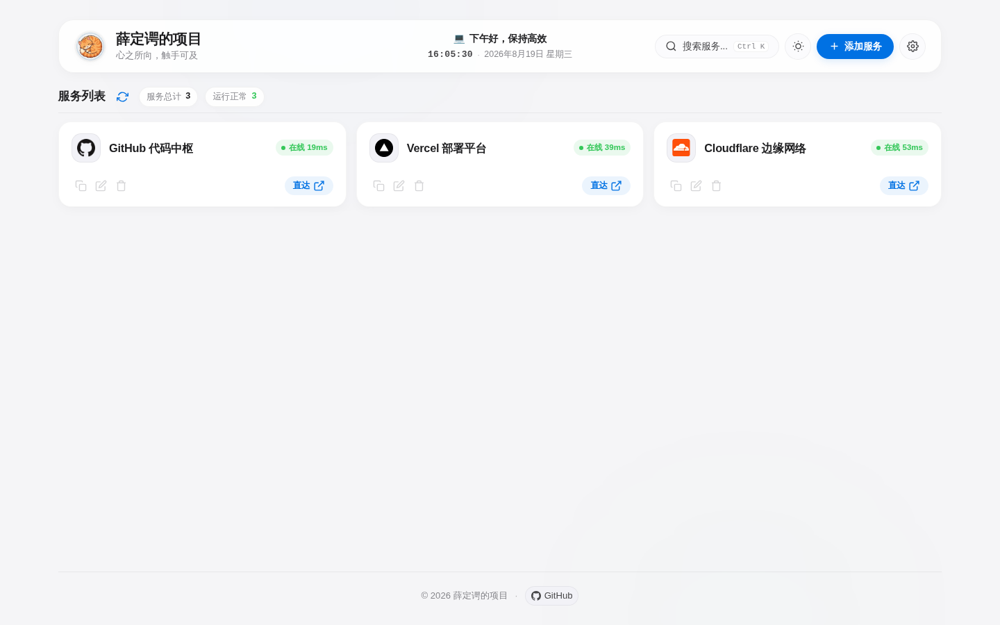
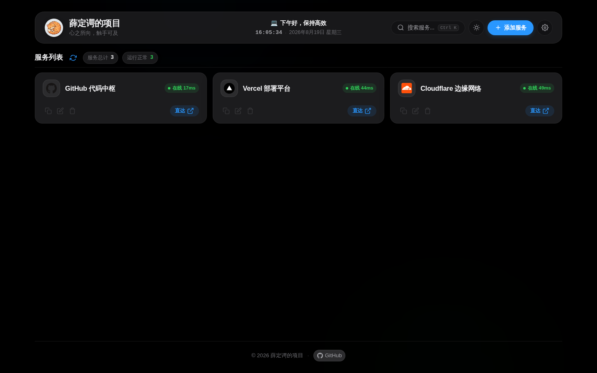

<div align="center">

# 🐱 薛定谔的项目 (Schrödinger's Portal)

**Editorial / Gallery 气质的轻量自托管服务导航与健康状态 Portal**

[](https://opensource.org/licenses/MIT)
[](https://nodejs.org)
[](https://www.docker.com/)

*心之所向，触手可及。*

<br/>

### Light Mode



### Dark Mode



</div>

---

## 📖 项目简介

**薛定谔的项目 (Schrödinger's Portal)** 是一个基于 **Vite + Vanilla JavaScript + Node.js** 的轻量个人服务器导航面板：用 Apple 风格卡片聚合常用服务，并通过服务端健康探针展示连通性与时延。

适合自托管场景：开箱即用、镜像小、无数据库、无前端框架依赖。

---

## ✨ 核心特性

- 🗞️ **Editorial / Gallery 视觉**：暖纸色 Light、博物馆夜间 Dark，克制的环境色与材质感。
- 🧩 **Node.js 首屏预渲染**：服务端注入项目卡片，降低首屏空白。
- 🔍 **Spotlight 搜索**：`Ctrl + K` / `⌘ K`，键盘导航与回车直达。
- 💓 **服务端后台健康探针**：可信项目由服务端 daemon 探测；浏览器主要读取缓存；自定义项目才主动探测。
- 🖼️ **自动 Favicon 识别**：自建服务优先同源路径；公开站点域名 fallback；失败回退本地图标。
- 💾 **浏览器本地编辑**：添加 / 编辑 / 删除保存在当前浏览器 LocalStorage，不会自动改服务器配置，也不会多设备同步。
- 🐳 **Docker / Compose / Node / PM2** 多种部署方式。

---

## 🚀 快速开始

### 方式一：Docker 一键拉取（推荐）

```bash
docker run -d \
  --name schrodinger-portal \
  --restart unless-stopped \
  -p 3000:3000 \
  ghcr.io/uncat2310/schrodinger-portal:latest
```

访问 `http://你的服务器IP:3000`。

### 方式二：Docker Compose

```bash
git clone https://github.com/uncat2310/schrodinger-portal.git
cd schrodinger-portal
docker compose up -d
```

说明：`docker-compose.yml` 同时声明了 `image` 与 `build`。正式部署会优先使用 GHCR 镜像；本地也可 `docker compose build` 自行构建。

### 方式三：Node.js

要求：Node.js 18+。

```bash
npm ci
npm run build
npm start
```

可选 PM2：

```bash
npm install -g pm2
pm2 start server.js --name "schrodinger-portal"
pm2 save
```

可选 systemd（推荐生产）：

> 生产环境建议使用**独立非 root 用户**运行 Node 服务。

```bash
# 创建专用用户与目录权限
sudo useradd --system --home /srv/schrodinger-portal --shell /usr/sbin/nologin schrodinger
sudo chown -R schrodinger:schrodinger /srv/schrodinger-portal

cat >/etc/systemd/system/schrodinger-portal.service <<'EOF'
[Unit]
Description=Schrodinger Portal - Service Navigation and Health Probe
After=network.target

[Service]
Type=simple
User=schrodinger
Group=schrodinger
WorkingDirectory=/srv/schrodinger-portal
ExecStart=/usr/bin/node /srv/schrodinger-portal/server.js
Restart=always
RestartSec=5
Environment=PORT=3000
Environment=NODE_ENV=production

[Install]
WantedBy=multi-user.target
EOF

systemctl daemon-reload
systemctl enable --now schrodinger-portal.service
```

常用命令：

```bash
systemctl status schrodinger-portal
systemctl restart schrodinger-portal
journalctl -u schrodinger-portal -f
```

反向代理只需指向 `127.0.0.1:3000`（与 unit 名称无关）。若你曾使用旧名 `aetherhub`，请改用 `schrodinger-portal`。

---

## ⚙️ 配置

### 服务端默认项目

优先读取：

```text
config/projects.json
```

该文件已在 `.gitignore` / `.dockerignore` 中忽略，用于存放你自己的服务列表（可含内网地址）。公开仓库请使用示例文件：

```bash
mkdir -p config
cp config/projects.example.json config/projects.json
```

示例仅包含 `github.com` / `vercel.com` / `cloudflare.com` 等公开站点。

Docker 挂载示例：

```bash
docker run -d \
  --name schrodinger-portal \
  --restart unless-stopped \
  -p 3000:3000 \
  -v "$PWD/config/projects.json:/app/config/projects.json:ro" \
  ghcr.io/uncat2310/schrodinger-portal:latest
```

### 环境变量

| 变量 | 默认 | 说明 |
| :--- | :--- | :--- |
| `PORT` | `3000` | 监听端口 |
| `CORS_ORIGIN` | 空 | 默认同源，不返回 `Access-Control-Allow-Origin: *`；需要跨域时显式设置 |
| `ALLOW_INSECURE_TLS` | `false` | 为 `true` 时探针才忽略 TLS 证书错误；默认严格校验 |
| `TRUST_PROXY` | `false` | 仅当服务位于**可信反向代理**之后，且后端端口不对公网直接暴露时，才设为 `true` 以信任 `X-Forwarded-For`；默认不信任客户端伪造的转发头 |

---

## 💾 数据持久化说明

本项目采用低冲突的双层数据源：

```text
服务器 config/projects.json（或内置公开 Demo）
        ↓
   SSR 首次加载

浏览器内添加 / 编辑 / 删除
        ↓
   localStorage（按浏览器隔离）
```

请明确：

- 页面内编辑**默认只写入当前浏览器 LocalStorage**
- **不会**自动修改服务器 `config/projects.json`
- **不会**自动多设备同步
- 清除站点数据会丢失浏览器侧修改
- 需要服务端预设时，请手工维护 `config/projects.json`

若 SSR 注入的项目与 LocalStorage 不一致，客户端会按 LocalStorage 重新渲染，避免错位接管。

---

## 💓 健康探针说明

- 主路径：服务端根据可信项目 ID 或经过校验的 URL 发起 HTTP(S) 探测
- 客户端任意 URL 探测会拒绝 localhost / 私网 / link-local / 云 metadata 等目标（防 SSRF）
- HTTPS 默认启用证书校验
- 状态文案：`在线` / `不可用` / `检测中`
- 浏览器 `no-cors` fallback 只能说明请求可能发出，**不是高精度真实测速**

---

## 🖼️ Favicon 说明

**自动 Favicon 识别**含义是：

- 针对常见自建服务识别原生 favicon 路径
- 对公开网站使用域名 favicon fallback（如 DuckDuckGo icons）
- 加载失败回退本地 `/favicon.svg`

当前实现**不会**解析目标站点 HTML 中的 `<link rel="icon">`。第三方 fallback 可能向第三方服务暴露公开 hostname；自建服务优先走同源路径，避免误导为“端到端抓取原版 favicon”。

---

## 🔄 Docker 更新

```bash
docker pull ghcr.io/uncat2310/schrodinger-portal:latest
docker stop schrodinger-portal
docker rm schrodinger-portal
docker run -d \
  --name schrodinger-portal \
  --restart unless-stopped \
  -p 3000:3000 \
  ghcr.io/uncat2310/schrodinger-portal:latest
```

Compose：

```bash
docker compose pull
docker compose up -d
```

---

## 🌐 反向代理示例

### Caddy

```caddy
portal.example.com {
    reverse_proxy 127.0.0.1:3000
}
```

### Nginx（可选）

```nginx
server {
    listen 80;
    server_name portal.example.com;

    location / {
        proxy_pass http://127.0.0.1:3000;
        proxy_http_version 1.1;
        proxy_set_header Host $host;
        proxy_set_header X-Real-IP $remote_addr;
        proxy_set_header X-Forwarded-For $proxy_add_x_forwarded_for;
        proxy_set_header X-Forwarded-Proto $scheme;
    }
}
```

---

## 🔐 安全建议

- 建议通过 HTTPS 反向代理对外提供服务
- 不要把私有 `config/projects.json`、token、密钥提交进公开仓库
- 探针仅用于 HTTP/HTTPS 健康检查，不要把任意公网实例当作开放 SSRF 入口
- 暴露在公网时请使用最新镜像 / 最新代码

---

## 🛠️ 项目结构

```text
schrodinger-portal/
├── public/                      # 静态资源
│   ├── avatar.jpg               # 默认头像 / Apple Touch Icon
│   ├── favicon.svg              # 浏览器 Favicon
│   └── icons/                   # 可选本地图标
├── config/
│   └── projects.example.json    # 公开示例配置（复制为 projects.json）
├── docs/screenshots/            # README 真实界面截图
├── shared/                      # 前后端共用小工具（转义 / URL / 问候 / favicon / SSRF）
├── test/                        # node:test 安全烟测
├── src/
│   ├── data/defaultConfig.js    # 前端默认配置
│   ├── services/pingService.js  # 前端探针客户端
│   ├── app.js                   # 前端交互与状态
│   └── style.css                # Vanilla CSS
├── index.html
├── server.js                    # 生产静态服务 + SSR + 探针 API
├── Dockerfile
├── docker-compose.yml
├── .dockerignore
└── README.md
```

---

## ⌨️ 快捷键

| 快捷键 | 功能 |
| :--- | :--- |
| `Ctrl + K` / `Cmd + K` | 打开 Spotlight 搜索 |
| `↑` / `↓` | 搜索结果导航 |
| `Enter` | 打开所选服务 |
| `ESC` | 关闭弹窗 |

---

## 🤝 参与贡献

欢迎提交 Issue 与 Pull Request。

1. Fork 本仓库
2. 创建分支 (`git checkout -b feature/AmazingFeature`)
3. 提交修改 (`git commit -m 'Add some AmazingFeature'`)
4. 推送分支 (`git push origin feature/AmazingFeature`)
5. 开启 Pull Request

---

## 📄 开源许可证

本项目基于 [MIT License](LICENSE) 协议开源。
